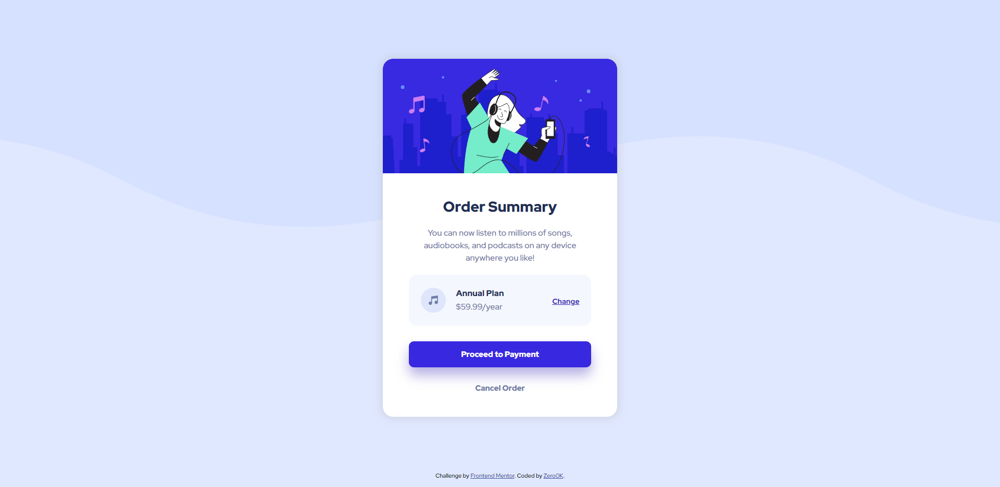

# Frontend Mentor - Order summary card solution

This is a solution to the [Order summary card challenge on Frontend Mentor](https://www.frontendmentor.io/challenges/order-summary-component-QlPmajDUj). Frontend Mentor challenges help you improve your coding skills by building realistic projects. 

## Table of contents

- [Overview](#overview)
  - [The challenge](#the-challenge)
  - [Screenshot](#screenshot)
  - [Links](#links)
- [My process](#my-process)
  - [Built with](#built-with)
  - [What I learned](#what-i-learned)
  - [Useful resources](#useful-resources)
- [Author](#author)

**Note: Delete this note and update the table of contents based on what sections you keep.**

## Overview

### The challenge

Users should be able to:

- See hover states for interactive elements

### Screenshot

### Links

- Solution URL: [Link](https://github.com/Zero0k/frontend-mentor-order-summary-component)
- Live Site URL: [Link](https://zero0k.github.io/frontend-mentor-order-summary-component/)

## My process

### Built with

- Semantic HTML5 markup
- CSS custom properties
- Flexbox
- CSS Grid

### What I learned

A lot. From using, styling and positioning divs, flex boxes and grids to conditionally modifying styles and so so much more. But first and foremost understanding all the concepts.

I am sure the end result probably contains some bad practice, and things that could have been done in a better way, but — at least to me — it seems very much functional.

### Useful resources

- [Responsively.app](https://responsively.app/) - This really helped preview the page on multiple different devices at once, and see how different changes affect different platforms.

## Author

- Github - [@Zero0k](https://github.com/Zero0k)
- Frontend Mentor - [@Zero0k](https://www.frontendmentor.io/profile/Zero0k)
